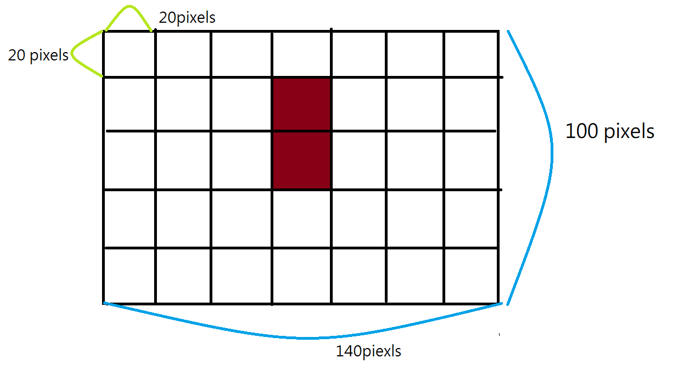

# Snake Game

Hello, every one.
This project is an implementation of Snake Game in Javascript.
I divided this program into three files in Javascript, which are main.js, snake.js, food.js.

Importantly, because the snake is drawn by rectangles, the map must be divided into checkerboard-like grid with the width and the height of the snake.

Look at the picture as below. It is to tell you why map must be divided into checkerboard-like grid. Red area represents snake.

Next, I will introduce these files one by one.

## main.js

This file is mainly for drawing the pictures, starting animation , creating the object, and listening for the keyDown events.

## snake.js

This file is a class which defines a snake.

#### Attributes

- x and y : they are the position of the snake.

- xSpeed and ySpeed : they are the direction of the snake (positive and negative signs) and telling snake how many grids to go (value).

- width and height: They are used to set how many pixels a grids need, that is, how many pixels the a snake need. Because snake is drawn by the rectangles.

- tail : It is an array which makes snake ce longer.
- size : It records the count of the food which snake eats.

#### Method

- move( ) : This function is to let the snake to move. Note that snake move one grid, so x = x + (xSpeed _ width) and y = y + (ySpeed _ height). Another important point is that the each grid in the snake tail array gives its position to the previous one, and giving the newest position to the lastest one. Thus, Snake looks like walking.
- show( ): Drawing snake with canvas.
- doesEat( ) : check whether the snake eats food.
- isDead( ): check whether the snake is dead.
